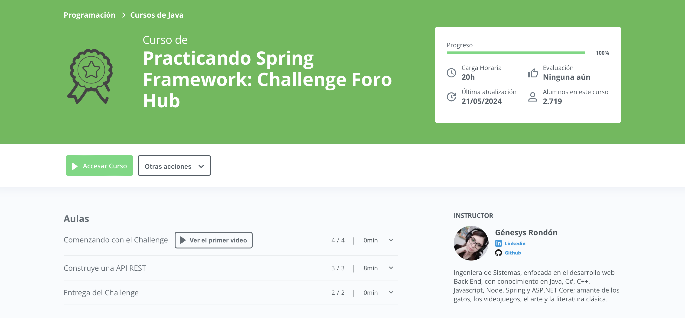

  

# Final Project

Repository for the final project of the "BackEnd Developer" track from Alura Latam and ORACLE ONE.

## Badges

## Table of Contents

* [Final Project](#Final-Project)

* [Badges](#Badges)

* [Table of Contents](#Table-of-Contents)

* [Project Description](#Project-Description)

* [Project Status](#Project-Status)

* [Main Features](#Main-Features)

* [Technologies Used](#Technologies-Used)
  
* [Medal](#Medal)

* [Developer](#Developer)

## Project Description

This challenge involves using Spring Boot, MySQL, and Java 17 to develop a REST API that allows users to manage topics in a forum. The application includes functionalities for creating, displaying, updating, and deleting topics, implementing security practices with JSON Web Tokens (JWT) for authentication. Additionally, Insomnia is used to test the endpoints and MySQL for data persistence.

## Main Components

* JPA Entities
* Repositories
* Services
* JPA Configuration
* Main Application

## Work Methodology

The work methodology followed an agile development system using the Trello tool, considering the following stages:

* "Ready to Start"
* "In Development"
* "Paused"
* "Completed"

The user interface can be seen below:

## Project Status

There is much room for improvement, but despite the conclusion of the ORACLE ONE program, I will continue to enhance it in order to achieve an optimal version.

### Main Features

* Implementation of a REST API with Spring Boot.
* Use of MySQL for data persistence.
* Developed in Java 17 with IntelliJ IDEA support.
* Utilization of Insomnia for API testing.
* Full functionalities for managing topics: create, list, show specific, update, and delete.
* Implementation of validations according to business rules.
* Integration of security through JSON Web Tokens (JWT) for authentication.
* Adherence to best practices of the REST model for the structure of the API routes.
* Non-graphical user interface, completely focused on the backend.
* Organized development managed through Trello for task management and project progress tracking.

## Technologies Used

* Spring Boot
* MySQL
* Java 17
* Insomnia
* REST API
* JSON Web Tokens (JWT)
* Topic Management (CRUD)
* Security and Authentication

## Medal

## Developer

|[  Nicole Lastra Quiroz ](https://github.com/Nicole-lq)|
|---|
